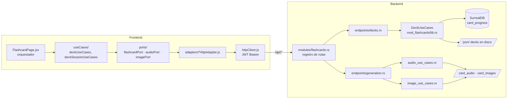

# Módulo `flashcards` — Estudio con tarjetas

## Propósito

Módulo principal del producto: estudio de vocabulario con flashcards por categorías gramaticales
y pares de idiomas (es_en, en_es, en_fr…), con progreso por usuario (SRS), audio TTS (.ogg Opus)
e imágenes generadas por IA (.avif).

## Estado y roadmap

- Estado: **activo** — es el módulo por defecto (`VITE_DEFAULT_MODULE=flashcards`).
- La generación de media (audio/imágenes) es tooling transversal: ver
  [`media-generation.md`](media-generation.md).

## Mapa de archivos

| Capa | Ruta | Qué contiene |
|---|---|---|
| Dominio | `backend/core/src/domain/models/flashcard.rs` | modelo de tarjeta |
| Puerto DB | `backend/core/src/ports/db_repository.rs` | `CardProgressRepository` |
| Casos de uso | `backend/mod_flashcards/src/lib.rs` | `DeckUseCases` |
| Casos de uso media | `backend/mod_flashcards/src/audio_use_cases.rs`, `image_use_cases.rs` | síntesis/generación — piden voz/prompt final vía `AudioGenerator::pick_voice` / `ImageGenerator::finalize_prompt` (puertos), nunca conocen nombres de voz o hints concretos de un proveedor |
| Prompts/voces Gemini (demo + TTS) | `backend/api_main/src/infrastructure/ai/gemini_landing_demo_prompts.rs`, `routing_tts_provider.rs`, `elevenlabs_tts_provider.rs` | contenido específico de proveedor (system prompts, nombres de voz) — vive en infraestructura, no en `mod_flashcards` (2026-07-26) |
| Batch | `backend/mod_flashcards/src/batch/` | generación batch de media |
| Registro rutas | `backend/api_main/src/modules/flashcards.rs` | los 17 endpoints del módulo |
| Handlers decks | `backend/api_main/src/api/endpoints/decks.rs` | catálogo, progreso, stats |
| Handlers media | `backend/api_main/src/api/endpoints/generation.rs` | resolve/generate/upload/delete |
| Frontend módulo | `client/src/modules/flashcards/` | manifiesto (`index.jsx`), `FlashcardPage.jsx` (orquestador), `composition.js`, `ports/`, `adapters/`, `useCases/`, `context/`, `features/` |
| Kit compartido UI | `client/src/components/flashcardStudy/` | la tarjeta compartida con el demo de landing — **leer `client/GEMINI.md` §4 antes de tocarla** |
| Contenido | `json/<par>/<categoría>/<nivel>/*.json` | decks (sincronizados al proxy real, hoy GCP) |
| Media | `card_audio/`, `card_images/` | audio .ogg e imágenes .avif por categoría |
| Test de congruencia imagen-frase | `scripts/check_flashcard_images.py` | verificación determinística (sin IA) de que cada frase carga la imagen correcta entre `es_en`/`en_es`/`es_de` — ver sección abajo |

## Plano del módulo (diagrama)



## Contratos / endpoints

Registrados en `backend/api_main/src/modules/flashcards.rs`; DTOs en
`api_main/src/api/endpoints/decks.rs` y `api_main/src/api/dto/generation.rs`. Todos con JWT.
Convención: `course_direction` (`es_en` default | `en_es`…) es query/campo opcional en casi todos.

### Catálogo y progreso (`decks.rs`)

| Método | Ruta | Entrada exacta | Devuelve |
|---|---|---|---|
| GET | `/api/categories` | query: `course_direction`, `include_counts` (default true) | categorías con conteos |
| GET | `/api/available-flashcards-files` | query: `course_direction`, `category` | decks de la categoría |
| GET | `/api/deck-summaries` | query: `category`, `course_direction?` | resúmenes (`total` y `learned`) de todos los mazos de la categoría (todos los niveles en 1 sola respuesta); claves sin `.json`, igual formato que `deckNames` en el frontend |
| GET | `/api/flashcards-data` | query: `user_id`, `category`, `deck`, `course_direction` | tarjetas del deck + progreso del usuario |
| POST | `/api/update-status` | `{user_id, category, deck, index, learned, course_direction?}` | progreso de 1 tarjeta |
| POST | `/api/update-batch` | `{user_id, category, deck, course_direction?, cards: [CardUpdateItem]}` | progreso en lote |
| POST | `/api/reset-all` | `{user_id, category, deck, course_direction?, scope?, confirm}` | reset de progreso |
| GET | `/api/srs/due` | query: `course_direction`, `limit` (default 5000) | tarjetas SRS pendientes |
| GET | `/api/learning-stats` | query: `course_direction` | estadísticas de aprendizaje |
| GET | `/api/phonics-data` | — | datos de fonética |
| POST | `/api/study/touch` | — (usuario del JWT) | registra día de estudio (racha) |

### Media (`generation.rs` — dto/generation.rs)

| Método | Ruta | Entrada exacta | Devuelve |
|---|---|---|---|
| POST | `/api/resolve-audio` | `SynthesizeSpeechBody` (ver abajo) | URL `?v=` si el audio EXISTE; 404 si no — **nunca genera** |
| POST | `/api/synthesize-speech` | `SynthesizeSpeechBody` | `{audio_url, voice_name, from_cache}` — genera si falta (premium/admin) |
| POST | `/api/resolve-image` | `{category, deck, index, def_index, course_direction?, form?}` | URL `?v=` si existe; 404 si no — **nunca genera** |
| POST | `/api/generate-image` | `GenerateImageBody`: lo de resolve + `{prompt, meaning?, usage_example?, usage_context?, alternative_example?, force_generation?, form?, legacy_image_path?, prompt_engine?, scene_complement?}` | `{path}` — pipeline Qwen→ComfyUI (premium/admin) |
| POST | `/api/upload-image` | multipart (ver `UploadImageRequest` en `mod_flashcards/src/image_use_cases.rs`) | sube imagen manual |
| DELETE | `/api/delete-image` | `{category, deck, index, def_index, course_direction?, form?}` | borra imagen |
| POST | `/api/delete-audio` | `DeleteAudioBody` (como Synthesize sin force) | borra audio |
| DELETE | `/api/delete-definition` | `{category, deck, index, def_index, course_direction?, form?}` | **admin-only** (`require_image_customization_role`) — elimina permanentemente `definitions[def_index]` del card en `index`, escribiendo el JSON del deck vía `DeckUseCases::delete_definition` (`mod_flashcards/src/lib.rs`). `form` selecciona v1 (raíz, default) / v2 (`irregular.past`) / v3 (`irregular.participle`). `404` si `index`/`def_index` están fuera de rango. |

`SynthesizeSpeechBody`: `{category, deck, text, voice_name, verb_name?, tone?, lang?, course_direction?, exclude_voice?, force_regenerate?}`.

### Direcciones de curso soportadas

`normalize_course_direction` (duplicada en `mod_flashcards/src/lib.rs` y
`api_main/src/infrastructure/storage/local_repository.rs`) es el único candado: cualquier
`course_direction` no reconocido cae silenciosamente a `es_en`. Hoy reconoce `es_en` (default),
`en_es` y **`es_de`** (nativo español → aprende alemán, agregado jul 2026; empezó como piloto en
`json/es_de/adjectives/` pero ya alcanzó paridad completa con `es_en` — 256/256 archivos, todas las
categorías). Auditoría de congruencia frase-imagen (jul 2026): ~15 mazos tienen desalineación de
índice (palabras insertadas de más en `es_de` sin su contraparte en `es_en`, lo que corre el
`imagePath` compartido hacia el concepto equivocado desde ese punto en adelante) y una veintena de
entradas de pronombres tenían `imagePath` apuntando a un mazo `_e_*` distinto por error de
construcción — ya restauradas. Ver detalle en el historial de conversación / reporte de auditoría;
los ~15 mazos con desalineación de índice siguen pendientes de decisión de contenido (no se
autocorrigen solos, requieren decidir si se agrega/quita el concepto insertado).
`json/` contiene además pares sin registrar en esa función (`en_fr`, `es_fr`, `es_it`, `es_pt`,
`fr_en`, `fr_es`, `it_es`, `pt_en`, `pt_es`): son contenido futuro/WIP, el manifiesto los indexa
pero la API los sirve como `es_en` hasta que se les dé de alta ahí. `contracts/courseDirection.js`
(frontend) es el espejo: `studyLanguage` 'es'→`en_es`, 'de'→`es_de`, resto→`es_en`.

**Las imágenes NO dependen de la dirección** (`image_use_cases.rs::global_image_base` ignora
`course_direction` a propósito — test `global_images_are_shared_across_course_directions`): la
ruta es `category/deck/deck_card_N_defM`, así que un mazo nuevo en otra dirección para la MISMA
categoría/mazo/índice reutiliza el archivo ya generado. El audio SÍ se namespacea por dirección
(`card_audio/<direction>/...`) porque el idioma hablado cambia; Gemini TTS detecta el idioma del
texto (ignora el parámetro `lang` en la síntesis real — `gemini_tts_provider.rs`), así que un
idioma nuevo no requiere cambios de proveedor, solo contenido JSON con texto en ese idioma.

Al construir un mazo `es_de` a partir de uno `es_en` existente: reutilizar tal cual `meaning`,
`usage_example_es`, `usage_context_en/es` e `imagePath` (el significado en español y la imagen no
cambian); traducir solo `name`, `phonetic`, `spoken_phonetic_us`, `usage_example` (alemán) y
`pronunciation_guide_es` (aproximación fonética en español de la frase alemana). Script usado para
el piloto: `scripts/build_es_de_adjectives.py` (no versionado, vivió en el scratchpad de la sesión).
Los mazos fusionados `*_e_*.json` (patrón ya existente en `es_en`, combina dos temas en un
archivo) reutilizan la traducción de cada palabra compartida en vez de retraducirla.

**Selector visible**: `FloatingMenu.jsx` (`studyDirectionControl`) tiene el tercer botón
"Spanish → German" / "Español → Alemán" (`config/translations.js`, claves `learnGerman`).
`AuthContext.updateStudyLanguage` y `POST /api/auth/study-language` (antes solo `en`/`es`) ya
aceptan `de` y lo persisten en la cuenta (`surreal/user_repository.rs`). Verificado con el arnés
de `client/scripts/refactor_visual_shots.py` (estado `floating-menu`, 3 viewports, sin romper
layout) y con un click real vía Playwright que confirma el cambio de estado. **Pendiente**: el
selector de idioma de estudio del menú PWA inferior (`PwaShellNavigation.jsx`/`PwaBottomDock.jsx`)
y el paso de idioma del onboarding (`OnBoardingFlashcard.jsx`) siguen mostrando solo en/es — no se

**Bug real encontrado y corregido (jul 2026)**: cada adaptador HTTP de `client/src/adapters/` y
`client/src/modules/{flashcards,dashboard}/adapters/` define su PROPIO `normalizeCourseDirection`
local (sin compartir código entre ellos) con el mismo patrón binario
`courseDirection === 'en_es' ? 'en_es' : 'es_en'`. Aunque `contracts/courseDirection.js` ya
resolvía `studyLanguage='de'` → `course_direction='es_de'` correctamente, **cada adaptador volvía
a colapsar `es_de` a `es_en` justo antes de construir la URL** — el síntoma era que, tras elegir
alemán, seguían apareciendo tarjetas en inglés (`es_en`) en vez de alemán. Se corrigieron los 8
sitios: `flashcardHttpAdapter.js`, `srsHttpAdapter.js`, `studyAudioHttpAdapter.js`,
`studyImageHttpAdapter.js`, `reviewSuggestionHttpAdapter.js`, `deckPreviewHttpAdapter.js`,
`learningStatsHttpAdapter.js` y `useDeckSession.js::normalizeStoredCourseDirection` (clave de
progreso en lote). Verificado interceptando las peticiones de red reales tras cambiar a alemán:
`categories`, `available-flashcards-files`, `flashcards-data` y `deck-summaries` ya mandan
`course_direction=es_de`. **Lección**: al agregar una dirección nueva, buscar
`grep -rn "en_es' ? 'en_es' : 'es_en'"` en `client/src` — el patrón se duplica sin una fuente
única, así que un solo arreglo (el contrato) no basta.
tocaron en este cambio.

**Frontend, deuda conocida**: `cardLanguageUtils.js` ya mapea `getAudioLang('de') → 'de'` y
`UIContext`/`browserLanguage.js` aceptan `studyLanguage='de'` sin normalizarlo a `'en'`, pero
**no hay selector visible** para elegirlo todavía (`FloatingMenu.jsx` solo pinta en/es) — agregar
un tercer botón ahí es un cambio visual y requiere el arnés pixel-diff de `client/GEMINI.md` §8,
no incluido en este cambio. Tampoco se extendió `isLearningEnglish`-gated UI copy (tooltips
"Play word"/"Reproducir palabra", guía fonética visible en la tarjeta): para `studyLanguage='de'`
hoy caen al branch en inglés/oculto por defecto — cosmético, no bloquea audio/contenido.

### Auditoría de congruencia imagen-frase (`scripts/check_flashcard_images.py`)

Test **determinístico, sin IA** — antes de tocar contenido de `json/es_en`, `json/en_es` o
`json/es_de`, o de sospechar que una tarjeta muestra la imagen equivocada, correrlo primero:

```bash
python3 scripts/check_flashcard_images.py            # reporte en scripts/flashcard_image_report.json
```

Verifica, para cada `definitions[]` de cada palabra: (1) que `imagePath` tenga valor, (2) que el
`.avif` exista de verdad en disco, (3) que en `en_es`/`es_de` coincida con el `imagePath` de
`es_en` en la misma posición alineada (alineación = mismo concepto: `definitions[0].meaning` en
`es_en`/`es_de` vs `name`/`target_meaning_es` en `en_es`). Tarda segundos — no hace falta lanzarlo
en background ni esperar confirmación, se corre y se lee el reporte en el momento.

Tipos de hallazgo en el reporte: `IMAGE_MISSING` / `IMAGE_FILE_NOT_FOUND` / `IMAGE_MISMATCH_VS_BASELINE`
(bugs corregibles reasignando la ruta correcta — ya resueltos a jul 2026), `WORD_COUNT_MISMATCH` /
`WORD_MISALIGNED` / `DEF_COUNT_MISMATCH` (el mazo tiene distinta cantidad de palabras/sentidos que
`es_en` — la imagen de una palabra le queda pegada por posición a otra si no se corrige) e
`IMAGE_MISSING_NO_BASELINE` (mazos que solo existen en una dirección, sin par posicional en
`es_en` para comparar).

**Regla de oro al corregir un hallazgo: nunca generar una imagen nueva sin buscar antes si el
mismo concepto ya tiene una imagen generada en otro punto de `es_en`** (misma frase/idea, distinta
posición o distinto mazo `_e_*`) — la inmensa mayoría de los casos reales fueron exactamente eso:
una palabra insertada de más corrió el índice compartido y la palabra siguiente terminó apuntando
a la imagen de otra. Solo generar una imagen nueva (`POST /api/generate-image` o
`scripts/batch-images.sh`, ver `media-generation.md`) cuando el concepto genuinamente no existe en
ningún punto de `es_en` — y eso es una decisión de contenido del usuario, no algo que el test o la
IA deban decidir solos.

**Auditoría jul 2026**: 148 archivos / 1077 líneas de `imagePath` corregidas reutilizando imágenes
ya existentes (0 imágenes nuevas generadas). Quedaron sin resolver ~98 archivos (`es_de` y sobre
todo `en_es`) donde el mazo tiene más o menos palabras que `es_en` — 357 palabras sin imagen
verificable porque el concepto no existe en `es_en` en absoluto; ahí sí corresponde generar imagen
nueva cuando se decida completar ese contenido, o quitar la palabra del mazo.

### Invariantes (no romper)

- **`resolve-*` jamás genera media** — un 404 en resolve termina la anticipación/precarga (regla de `AI_OPERATIONS_CONTEXT.md`).
- **"Agregar al repaso" (SRS) NO marca la tarjeta como aprendida** (bug real jul 2026, reportado
  por usuario: "cuando la agregas al repaso no quiere decir que la debes de quitar del mazo
  original, solo es un recordatorio para que aparezca en el repaso"). `learned` estaba
  sobrecargado en dos roles: (1) sacar la tarjeta del mazo libre (`filterUnlearned` en
  `deckUseCases.js`) y (2) gate obligatorio (`WHERE learned = true`) de la query SQL de
  `/api/srs/due` (`card_progress_repository.rs::get_srs_review_candidates`). `addToReview`
  (`useDeckSession.js`) forzaba `learned: true` y removía la tarjeta de `filteredData` — arreglar
  solo el frontend no bastaba, porque sin tocar la query la tarjeta jamás habría aparecido en el
  repaso diario con `learned: false`. Fix de punta a punta: `addToReview` ahora manda
  `learned: Boolean(card.learned)` (conserva el valor real, casi siempre `false`) junto con
  `SrsEngine.scheduleForReview(...)`, sin tocar `masterData`/`filteredData`/`currentIndex`; la
  query SQL cambió a `WHERE ... AND (learned = true OR next_review_at != NONE) AND ...` para
  aceptar tarjetas programadas aunque no estén aprendidas (sin afectar el camino histórico de
  tarjetas aprendidas normalmente, que siguen entrando por `learned = true`). También se corrigió
  `reviewCard` (`useSrsDeckSession.js`): las acciones "No la sé"/"La sé" (FAIL/CORRECT) durante el
  repaso solo reprograman el calendario y conservan `card.learned` tal cual — ya no lo fuerzan a
  `true` (eso habría revertido el fix en la primera revisión). Solo "Ya la domino" (EXPEL,
  `box_level: 99`) sí gradúa la tarjeta a `learned: true`, porque es una señal explícita de
  dominio. Verificado con `GET /api/srs/due`: una tarjeta recién agregada aparece con
  `"learned": false` y su `next_review_at`/`box_level`/`ease_factor` programados.
- **`update-batch` es UNA transacción SurrealDB** (`BEGIN…COMMIT`), no N peticiones — no descomponerla.
- Las URLs de media devuelven query `?v=<mtime>-<tamaño>`: la identidad cambia al sobrescribir el archivo; no cachear sin la query.
- Las imágenes web/responsive nuevas usan **768×512 (3:2) AVIF** en generación individual,
  batch y subida manual. Los assets 896×512 existentes siguen siendo compatibles y no se
  regeneran ni eliminan automáticamente.
- El catálogo permite repetir contenido completado: los grupos completos y las subcategorías
  anidadas muestran `Reiniciar`, con confirmación antes de borrar progreso; la tarjeta de
  finalización expone `Repetir este mazo` y reutiliza el reset del deck activo.
- **Recomendaciones "Otros mazos para ti" priorizan la MISMA categoría activa** (feedback de
  usuario, jul 2026: "si estoy en verbos, recomiéndame verbos"). `buildPwaStudyRecommendations`
  (`useCases/pwaStudyRecommendations.js`) llenaba primero los espacios del carrusel con mazos de
  OTRAS categorías y solo caía a la categoría activa si sobraba espacio — quedaba invertido.
  Ahora arma `selected` en 3 pasadas: (1) otros mazos de `currentCategory` (permite repetir
  categoría), (2) diversifica con una categoría por mazo del resto, (3) rellena lo que falte sin
  restricción. Test: `pwaStudyRecommendations.test.js`.
- **Los MAZOS/niveles recién estudiados dentro de una categoría se hunden hacia el final de esa
  lista** (feedback de usuario, jul 2026: "termino un mazo, voy por el otro, que sea fácil elegir
  el próximo"). `sinkRecentCategory` (`config/catalogOrder.js`, nombre genérico — no es solo para
  categorías) acepta un string o un ARRAY de items "recientes" y los hunde al final (justo antes
  de los ya marcados `completed*`), conservando el orden en que llegaron. `CategoryContext.jsx`
  guarda `recentlyFinishedDecks` (array de `{ category, deck }`, persistido como JSON en
  `localStorage[flashcards_recently_finished_deck]`, ver `config/sessionKeys.js`) y lo actualiza
  vía `markDeckFinished(category, deckName)` — hace `pushRecent`: quita cualquier ocurrencia previa
  del mismo mazo y lo agrega al final (dedup + "el más reciente queda más al fondo"), NUNCA
  sobrescribe. `CategorySelector.jsx` filtra `recentlyFinishedDecks` por `currentCategory` y aplica
  `sinkRecentCategory` al calcular `localNestedDeckOrder` — reemplazó al helper local
  `partitionCompletedItems` (que solo hundía mazos 100% completos, no el recién visitado).
  `markDeckFinished` se invoca desde `FlashcardPage.jsx` (ref `deckFinishMarkedRef`, se resetea al
  cambiar de categoría/mazo/grupo) en tres momentos: (1) una sola vez por sesión de mazo cuando
  aparece `CompletionCard`/`reachedDeckEnd`, y (2)+(3) cada vez que el usuario ABRE el catálogo para
  elegir otra cosa (`openCatalog`, vía `location.state` o el handler `uiBridge`) — sin estos dos
  últimos, salir a media sesión (mazo NO terminado) para buscar otro dejaba el mazo activo arriba
  del listado. El provider stub de `modules/flashcards/index.jsx` para el modo SRS (que no usa
  `CategoryProvider` real) debe exponer `markDeckFinished` como no-op y `recentlyFinishedDecks: []`
  — si no, `FlashcardPage.jsx` lo llama igual (no chequea `isSrsMode` en los disparadores de
  `openCatalog`) y truena con "is not a function".
  ⚠️ **La CATEGORÍA de nivel superior (Verbos, Sustantivos…) deliberadamente NO se hunde** —
  `sortCategories` solo aplica orden de catálogo + preferencia arrastrada por el usuario, sin
  ningún hundido "reciente". Hubo una versión intermedia que sí la hundía (mismo mecanismo que los
  mazos, con `recentlyFinishedCategory(ies)`/`markCategoryFinished`) pero el usuario, tras probarla
  en vivo, pidió revertirla explícitamente: "la categoría debe queda[r] donde la organiza el
  sistema o donde el usuario lo coloc[ó]" — solo el mazo/tópico dentro de la categoría debe rotar,
  la categoría en sí se queda fija. Si se reintroduce el hundido de categorías, confirmarlo con el
  usuario primero — ya se probó y se pidió quitar. Tests: `catalogOrder.test.js` (lógica pura de
  `sinkRecentCategory`, incluye el caso de varios items recientes sin que el más viejo "flote de
  vuelta", y confirma que `sortCategories` ignora lo recientemente estudiado) y
  `context/CategoryContext.test.jsx` (integración: `CategoryProvider` real — `markDeckFinished`
  acumula en `recentlyFinishedDecks` sin tocar el orden de `categories`, para atrapar bugs de
  wiring/timing de React que un test de función pura no ve).
- **`FlashcardPage.jsx` ya NO auto-avanza al mazo recomendado apenas se completa uno** (bug real
  jul 2026, reportado por usuario: al marcar todas las tarjetas como aprendidas, la app saltaba
  sola al siguiente mazo sin mostrar la felicitación — el usuario nunca la veía). Causa: un
  `useEffect` disparaba `handleContinueRecommendation()` automáticamente en cuanto
  `justCompletedInSession` se volvía `true`, salvo que `navigationIntentRef.current === 'user'`
  (es decir, salvo que hubieras elegido el mazo a mano desde el catálogo justo antes) — como la
  mayoría de las sesiones normales llegan al mazo por carga inicial/resume (`navigationIntentRef`
  en `'initial'`, ver `navigationIntent.js`), el auto-avance corría casi siempre y se comía la
  pantalla de `CompletionCard` (que de por sí ya se calculaba correctamente vía
  `shouldShowCompletionCelebration`). Se eliminó ese `useEffect`: ahora la decisión de continuar,
  ver categorías o repetir el mazo es siempre del usuario, vía los botones de `CompletionCard`.
  Se conservó el otro `useEffect` (`dashboardResumeRef`) que sí sigue vigente: cuando se **reanuda**
  una sesión desde el dashboard (`location.state?.resumeSession`) hacia un mazo que YA estaba
  completado de una sesión anterior (`!justCompletedInSession && isCompletionVisible`), auto-avanza
  para no aterrizar en contenido stale ya terminado — caso distinto al reportado, no tocado.
- **`CompletionCard` tiene dos disparadores, no solo "aprendió todo"** (jul 2026): además del
  camino histórico (`filteredData.length === 0` tras marcar cada tarjeta con `markAsLearned`/
  `addToReview` — estado "Completado"), `nextCard()` (`useDeckSession.js`) ahora detecta el fin
  del array al navegar (swipe/flechas/botón "siguiente") y, en vez de dar la vuelta con `%` a la
  tarjeta 1, fija el estado `reachedDeckEnd` y muestra la misma `CompletionCard` con **copy
  distinto e íntegro** (prop `allLearned` en `CompletionCard`, calculado en `FlashcardPage.jsx`
  como `displayLearned === displayTotal`): badge, título y subtítulo cambian de
  "Excelente/Nivel completado/Terminaste el nivel…" a "Repaso terminado/Repasaste el
  nivel/Llegaste al final del nivel… marca las tarjetas que ya sabes…" — no solo la etiqueta
  "Estado". La copy de logro pleno ("Completado") solo debe verse cuando de verdad se marcó
  cada tarjeta como aprendida; reutilizar ese texto para un simple repaso navegado es engañoso
  (feedback de usuario, jul 2026). El subtítulo del caso "Repasado" motiva a continuar (tono
  "¡Buen trabajo!") y ofrece 3 salidas: seguir con la ruta recomendada, ver categorías o repasar
  de nuevo — no solo instruir a marcar tarjetas. El botón de reinicio también se bifurca por el
  mismo `allLearned`: si se aprendió todo, sigue siendo `resetDeck` ("Repetir este mazo", borra
  progreso vía API con confirmación — tiene sentido, ya está todo aprendido); si fue un repaso
  navegado sin marcar todo, usa la función nueva `reviewDeckAgain` (`useDeckSession.js`) —
  "Repasar de nuevo" — que solo hace `setCurrentIndex(0)` y limpia `reachedDeckEnd`, **sin**
  tocar el progreso ni pedir confirmación, porque no hay nada que perder/borrar. Claves nuevas
  en `translations.js`: `badgeReviewed`, `groupTitleReviewed`, `levelTitleReviewed`,
  `groupSubtitleReviewed`, `levelSubtitleReviewed`, `statusValueReviewed`, `reviewAgainButton`
  (ES/EN). Antes de este cambio, terminar de repasar un mazo sin marcar ninguna tarjeta como
  aprendida hacía un bucle infinito de vuelta a la tarjeta 1 sin ninguna
  pantalla de cierre. `reachedDeckEnd` se resetea junto con `justCompletedInSession` en cada
  cambio de categoría/deck/grupo y en `resetDeck`/`resetDeckByName`. `prevCard()` no se tocó
  (sin reporte de bug navegando hacia atrás). `useSrsDeckSession.js` conserva el mismo
  patrón de `%` sin chequeo de fin — deliberado: el modo SRS ya cierra la sesión con su propio
  mensaje ("Repaso diario completado") cuando se agotan las tarjetas pendientes vía las acciones
  de review, no vía swipe libre.
- **Cerrar/terminar el tour de onboarding NUNCA debe navegar si `completeOnboarding()` no confirmó
  éxito** (bug real jul 2026, reportado por usuario: "cuando le doy click a la X, me regresa de
  nuevo a la primera pantalla del onboarding... está como en un bucle"). `handleClose` y
  `handleFinish` (`FlashcardOnboardingTour.jsx`) llamaban `await completeOnboarding()` y luego
  `navigate(location.pathname, { replace: true })` **sin comprobar el resultado** — a diferencia
  de `OnBoardingFlashcard.jsx` (`handleStartModule`/`handleSkipToHome`), que sí hace
  `if (!completedUser?.onboarding_completed) return;` antes de navegar. Si
  `completeOnboarding()` fallaba (reintenta 3 veces con backoff y devuelve `null` si las 3
  fallan — ver `AuthContext.jsx`), `onboardingRequired` seguía en `true` y el `navigate` de todos
  modos aterrizaba en `location.pathname` **sin el query `?onboarding_tour=flashcards`** que
  exime a `ProtectedRoute` de redirigir (`ProtectedRoute.jsx`: la condición de redirect a
  `/onboarding` solo se salta si `isOnboardingTour`) — el resultado era un rebote inmediato de
  vuelta a `/onboarding` (`OnBoardingFlashcard.jsx` paso 1), y si el usuario repetía el flujo y la
  falla persistía, quedaba atrapado en un ciclo. Reproducido localmente interceptando
  `POST /api/auth/onboarding` para forzar un 500: sin el fix, el `×` del tour devolvía a
  `/onboarding`. Primera versión del fix: mismo guard `if (!completedUser?.onboarding_completed)
  return;` en ambos handlers — evita el bucle, pero si `completeOnboarding()` de verdad no puede
  confirmar (caso real detectado después: JWT vencido/401 en la sesión del usuario, que hace
  fallar TODAS las llamadas autenticadas, no solo esta) el popup se queda sin responder ("no pasa
  nada visible" al tocar la X — reportado por el mismo usuario probando con una cuenta no-admin).
  Versión final: nuevo estado `isDismissed` — `handleClose`/`handleFinish` lo activan de
  inmediato (el popup se oculta sin esperar red) y `completeOnboarding()` sigue en segundo plano;
  si confirma, recién ahí se hace `navigate(location.pathname, { replace: true })` para limpiar el
  query; si nunca confirma, el usuario ya salió igual y la próxima carga completa vuelve a
  preguntar por onboarding en vez de dejarlo atrapado dentro de la misma sesión. Cerrar la guía
  con la sesión vencida sigue sin persistir `onboarding_completed` — eso requiere que el usuario
  vuelva a iniciar sesión para renovar el JWT, no es algo que este fix pueda resolver.
- **Cerrar la guía de onboarding a mitad de un paso que fuerza el catálogo abierto dejaba el
  catálogo huérfano en pantalla para siempre** (bug real ago 2026, reportado por usuario: "abro las
  categorías, selecciono la categoría, hace como que cierra pero se queda abierta" — solo pasaba en
  el primer login, cuando corre el tour). Varios pasos del tour (`elegir-categoria`,
  `catalogo-nivel`, `elegir-subtema` en `onboardingNavigationPlan.js`) tienen `prep.catalog: true`
  para mantener `CategorySelector` abierto mientras el usuario aprende a usarlo. El único lugar que
  lo vuelve a cerrar es el `useEffect` de `prep` (`FlashcardOnboardingTour.jsx` línea ~349), que
  solo corre cuando `activeStep` pasa a `null` (fin natural del tour). El `isDismissed` agregado en
  el fix anterior (bullet de arriba) oculta el tooltip de la guía al tocar la `×` **sin** pasar por
  ahí — `activeStep` se queda con el valor del paso en que se cerró, ese efecto no vuelve a correr,
  y `isCatalogVisible` queda atascado en `true`. Solución: `handleClose` ahora también hace
  `setIsCatalogVisible(false)`, `setIsSidebarOpen(false)` y `setIsFloatingMenuOpen(false)` junto con
  `setIsDismissed(true)` — mismo cleanup que ya hacía el camino de finalización natural, replicado
  para la salida manual. Reproducido y verificado con Playwright local (`dev-guest` + navegar a
  `/flashcard?onboarding_tour=flashcards`, forzar el catálogo abierto vía el tour y cerrar con la
  `×`): `catalog_open` pasaba de `true` (bug) a `false` (fix) tras el cierre. Detalle completo en
  [`scripts/troubleshooting_library.skill.md`](../../scripts/troubleshooting_library.skill.md#12-catálogo-de-categorías-se-queda-abierto-para-siempre-al-cerrar-la-guía-de-onboarding-primer-login).
- **El state de navegación `{ openCatalog: true }` debe consumirse vía el router, nunca con
  `window.history.replaceState`** (segunda causa raíz del mismo reporte, ago 2026 — la principal).
  Entrar a `/flashcard` desde fuera (menú flotante "Categorías" en el dashboard, PWA nav) navega
  con `state: { openCatalog: true }`; el efecto de `FlashcardPage.jsx` que lo consume "limpiaba"
  con `window.history.replaceState({}, '', pathname)`, que NO anula el `location.state` en memoria
  de React Router. Al agregarle `currentCategory`/`currentDeckName` como dependencias (commit
  `72bb031`, para `markDeckFinished`), cada selección de categoría/mazo re-ejecutaba el efecto con
  el state viejo aún truthy y **reabría el catálogo recién cerrado** ("elijo el mazo, hace como que
  cierra pero se queda abierta"). Fix: `navigate({ pathname, search }, { replace: true })` — anula
  el state de verdad (el efecto re-corre con `state=null` y sale), preservando `location.search`
  para no matar `?onboarding_tour=` si estuviera activo. Verificado con Playwright recorriendo el
  camino exacto: dashboard → "Categorías" → categoría → mazo (cerraba y quedaba cerrado), más los
  flujos del tour y del uiBridge sin regresión. **Prevención permanente**: ambos caminos (cierre
  del tour con la × y navegación con state desde el dashboard) quedaron cubiertos como tests de
  regresión en `client/e2e/first-login-and-full-navigation.spec.js` (tests 2 y 3), que corre con
  `./scripts/test-site-e2e.sh` y dentro de `test-local-preprod.sh --full`.
- **`nextCard()` no debe tener efectos secundarios dentro del updater de `setCurrentIndex`**
  (bug real jul 2026, reportado por usuario: navegar siguiente→siguiente→atrás→atrás en medio
  de un mazo grande a veces disparaba el popup de fin como si ya se hubiera llegado al final).
  Causa: la primera versión llamaba `setReachedDeckEnd(true)` **dentro** de la función updater
  pasada a `setCurrentIndex((p) => {...})` — una función impura. La app monta `React.StrictMode`
  (`main.jsx`), que en desarrollo invoca dos veces las funciones updater de `setState` para
  detectar justo este patrón. `nextCard` ahora lee `currentIndex` directo (ya está en scope,
  fresco en cada render) para decidir si activar `reachedDeckEnd`, y solo entonces llama
  `setCurrentIndex((p) => p + 1)` con un updater puro sin side effects. Si se toca este hook de
  nuevo: ningún updater de `setState` debe invocar otro `setX(...)` en su cuerpo.
- **`prevCard()` ya no da la vuelta de la tarjeta 1 a la última** (bug real jul 2026, reportado
  por usuario): antes usaba módulo (`(p - 1 + length) % length`), así que presionar "atrás" en
  la primera tarjeta te dejaba viendo la ÚLTIMA — y como `nextCard` decide el fin del mazo
  comparando el índice contra `filteredData.length - 1`, un "siguiente" inmediatamente después
  disparaba el popup de finalización sin haber recorrido el mazo. `prevCard` ahora hace
  `Math.max(0, p - 1)` (se queda en la primera tarjeta, no da la vuelta). Además, `reachedDeckEnd`
  ya no confía solo en el índice: `visitedCardIdsRef` (Set de `card.id`, alimentado por un efecto
  en `[filteredData, currentIndex]`) cuenta cuántas tarjetas *distintas* se vieron de verdad en
  esta pasada; `nextCard` solo activa el popup si `visitedCardIdsRef.current.size >=
  filteredData.length` (recorrida completa), y lo reinicia (`new Set()`) al dispararse, al cambiar
  de deck/categoría/grupo (`resetKey`) y en `reviewDeckAgain`/`resetDeck`/`resetDeckByName`.
- Generación/borrado exigen rol `premium`/`admin` (hoy validado en frontend — deuda #2 de `client/GEMINI.md` §9).
- **`/api/delete-definition` (admin-only, jul 2026)**: botón "Eliminar frase" en `DefinitionList.jsx`
  (junto a "Actualizar voz aleatoria", solo `isAdmin`), para filtrar frases que no corresponden a la
  palabra. Borra `definitions[def_index]` **solo del JSON de la `course_direction` activa** — como la
  imagen de cada `definitions[i]` se resuelve por posición y **se comparte entre direcciones de curso**
  (`image_use_cases.rs::global_image_base`), borrar una definición que no es la última corre el índice
  de las siguientes únicamente en esa dirección y puede desalinearlas con las otras (misma clase de bug
  que audita `scripts/check_flashcard_images.py` — `WORD_MISALIGNED`/`DEF_COUNT_MISMATCH`). No borra la
  imagen/audio de esa posición (quedan huérfanos). **Correr `check_flashcard_images.py` después de borrar
  una definición que no sea la última** para detectar y resolver cualquier desalineación resultante.
- `category='landing-demo'` enruta a otro proveedor TTS (ElevenLabs) — contrato con el módulo landing.
- **Resúmenes de catálogo en 1 sola petición** (optimización jul 2026, evita la ráfaga histórica de N peticiones paralelas — una por mazo — al abrir una categoría anidada): en categorías con `NESTED_LEVEL_CATEGORIES` (`deckUseCases.js`: `verbs`, `nouns`, `adjectives`, `adverbs`, `connectors`, `determinant`, `phrasal_verbs`, `preposition`, `pronouns`), `useDeckSession` pide `GET /api/deck-summaries` **una vez por categoría** — la respuesta trae los totales de **todos los niveles** (el backend no filtra por nivel activo), calculados desde el manifiesto en RAM (0 lecturas de disco) más 1 sola query `GROUP BY deck` en SurrealDB. Si el endpoint falla, cae de forma transparente a `Promise.allSettled` pidiendo cada mazo por separado (comportamiento anterior, solo como fallback). **Invariante de contrato**: las claves del mapa `summaries` deben ir sin extensión `.json` (`get_deck_summaries` en `mod_flashcards/src/lib.rs` las recorta con `trim_end_matches(".json")`) para calzar con `deckNames`/`currentDeckName`, que en el frontend siempre están sin extensión (`sortDeckNames` la quita). Un desajuste de formato aquí deja el badge de progreso pegado en "cargando…" para todo mazo que no sea el actualmente abierto, y puede además reintentar la petición sin converger (bug real detectado y corregido jul 2026 — no reintroducir el sufijo `.json` en esta clave).
- **Piel de la app (jul 2026)**: la zona de estudio usa los tokens de profundidad de
  `client/src/styles/app-brand.css` — lienzo `--brand-canvas` (#0b1120), tarjeta sólida
  `--brand-surface-card` (#1b2438) con borde hairline `--brand-border-subtle`. Iconos de
  acción neutros en reposo (`--brand-icon-idle`) que pasan a rosa de marca al interactuar;
  el verde queda reservado al check de "aprendida" y el demo de landing conserva su piel
  propia (`--lp-demo-*`). Todo override de color de la app va con ámbito
  `[data-variant='app']` para no tocar el demo. Iconografía: familia única Lucide
  (`react-icons/lu`) con trazo `--brand-icon-stroke: 2`; Feather (`fi`) solo donde el kit
  se comparte con el demo; Font Awesome prohibido (regla completa en `client/GEMINI.md` §6).
- En la app autenticada, el layout responsive (`max-width: 768px`, incluida la PWA) mantiene
  15 px de separación lateral compartida para la tarjeta y la barra de controles; el demo de
  landing conserva su geometría independiente. Los controles de navegación y el botón SRS
  miden 48 × 48 px en ese layout. Las filas de ejemplos usan `gap: 5px` y `padding: 3px`
  tanto en tarjetas estándar como de conjugación. En estas últimas, la imagen deja de imponer
  una relación de aspecto fija y ocupa el espacio vertical libre. La imagen principal usa
  `object-fit: contain` para mostrarse completa y una copia decorativa desenfocada cubre el
  espacio sobrante sin deformar ni recortar el contenido relevante. La tarjeta conserva el
  cálculo por espacio disponible, con `--fc-card-max-height: 560px` como tope móvil/PWA para
  evitar que se estire en pantallas altas y mantener cerca la barra y el footer; la separación
  entre tarjeta y barra de controles es de 20 px y la palabra principal usa `1.7rem`
  (jerarquía: la palabra manda sobre los ejemplos de `1.5rem`; en escritorio usa
  `clamp(1.6rem, 5vw, 2.25rem)` y la fonética baja a `clamp(1.05rem, 2.6vw, 1.15rem)`
  con mono moderno del sistema — solo variante app, el demo conserva sus valores). El botón
  SRS/calendario mantiene el círculo visual oculto hasta hover o focus. El footer absorbe el
  remanente inferior del shell móvil para no dejar una franja oscura al final, pero se oculta
  mientras está abierta la confirmación de nivel para no bloquear sus acciones. En móvil, el
  menú de cuenta expone el selector del idioma de interfaz; el aviso instalable PWA es no modal
  y solo sus botones capturan eventos, por lo que no puede bloquear tarjetas del catálogo.
- **Sesión PWA instalada**: bajo `display-mode: standalone` y hasta 768 px, el frente de la
  tarjeta adopta una composición inmersiva exclusiva: en conjugaciones, la imagen principal
  empieza en el final calculado de la barra verbal (`58px + 48px + safe-area`) y se alinea arriba,
  mientras los controles administrativos de imagen conservan 20 px de separación respecto a esa
  barra y el acceso SRS/calendario suma 10 px a su desplazamiento vertical para no pegarse a ella;
  sin hueco interno de `object-fit`, una copia desenfocada se prolonga detrás de la cabecera; la
  palabra/fonética/frases se superponen sobre un degradado inferior que concentra su oscuridad
  desde el 56%, alcanza su tramo fuerte entre el 72% y el 86% y deja visible la parte superior de la
  foto. Los reproductores de palabra y ejemplos, el acceso SRS y los controles de imagen comparten
  la superficie translúcida y blur de la navegación PWA; los reproductores de las frases usan el
  borde PWA reforzado para recortarse sobre la foto. Los iconos de reproducción y el
  calendario SRS y los controles de imagen miden 16 px dentro de sus áreas táctiles, con trazo
  Lucide uniforme. En los controles de imagen, regenerar usa blanco intenso y eliminar comparte
  el rojo vinotinto del reinicio. La barra de acciones se
  monta sobre el pie del hero y cada cambio real de tarjeta conserva el gesto horizontal con
  una transición de entrada, sin renderizar carrusel ni indicadores. Debajo se reserva la
  sección `Otros mazos para ti` con recomendaciones reales de `/api/learning-stats` (imagen,
  categoría, nivel y deck) navegables dentro de la sesión. Sus tarjetas PWA usan composición
  cinematográfica: imagen a sangre completa, degradado de contraste, metadatos en cristal y título
  superpuesto. La navegación inferior ya no se monta desde este módulo: es la píldora flotante de
  cristal del shell (`components/pwa/PwaShellNavigation.jsx` + `PwaBottomDock.jsx`, patrón WhatsApp
  iOS — ver `menu.jpg` en la raíz) con pestañas constantes (Inicio, Estudiar, Categorías, Idioma —
  sin buscador, deliberado), tokens `--pwa-nav-*` y estado activo por ruta; el carrusel
  `Otros mazos para ti` scrollea por detrás del cristal, su padding inferior la despeja y solapa
  2 px el hero para evitar una costura subpíxel visible al terminar la foto.
  `Categorías` abre el catálogo vía uiBridge (`openCatalog`) cuando la sesión de estudio está activa. La vista web
  responsive, el demo de landing y los flujos de carga/finalización conservan su composición anterior.
  Barra y recomendaciones consumen los tokens PWA compartidos de `styles/app-brand.css`; las tarjetas
  de recomendaciones usan el mismo radio y borde que el dashboard y reducen el halo rosa decorativo.
  La cabecera visual PWA vive en `components/flashcardStudy/features/PwaCardHeader.jsx` y muestra
  el isotipo blanco centrado; reemplaza dentro de esta sesión al header compartido, por lo que no
  aparecen hamburguesa, nombre `Fluency`, avatar ni segundo menú.
  En tarjetas de verbos irregulares, `ConjugationTable` se presenta como una cápsula de cristal
  única con v1/v2/v3 visibles; las frases PWA aumentan de tamaño y la barra de acciones usa
  superficies translúcidas con botones de contraste independiente, igual que la píldora de
  navegación del shell.
  El isotipo queda libre de contenedor visual y la cápsula irregular comparte la franja superior,
  a su derecha. Los controles siguen el patrón de acciones flotantes tipo Tinder: no existe una
  cápsula exterior y cada acción tiene su propio círculo, contraste y jerarquía táctil.
  La navegación anterior/siguiente no se renderiza visualmente en PWA: el cambio se hace con
  swipe. `PwaStudyControls.jsx` concentra únicamente reinicio, progreso y aprendida con Lucide;
  sus tres superficies comparten el cristal translúcido, borde neutro y blur de la navegación
  inferior; solo los iconos expresan estado: check verde y reinicio rojo vinotinto;
  el control web compartido permanece intacto. `PwaConjugationNav.jsx` y su CSS aíslan por
  completo V1/V2/V3 de `ConjugationTable`: ocupan una segunda fila dentro del mismo header
  difuminado como navegación móvil minimalista, sin subrayado, fondo ni cápsula: las formas se
  muestran con solo la inicial de cada palabra en mayúscula; la activa usa mayor peso y blanco intenso
  sin fondo, cápsula ni halo,
  mientras las demás bajan su contraste. Al presionar, el texto reduce brevemente su escala y cambia
  a blanco. No muestran pronunciación. La densidad negra superior se controla con
  `--pwa-header-black-opacity` en `PwaCardHeader.module.css`; una luz radial muy contenida evita un
  negro plano y la cabecera se desvanece verticalmente sobre la imagen con un difuminado amplio,
  sin desplazarla.
  Cuando la tarjeta no tiene conjugación, la cabecera se reduce a 64 px y la imagen comienza
  a 58 px; palabra, frases y acciones suben los 48 px que ocuparía V1/V2/V3, sin dejar hueco.
  Las frases de ejemplo PWA conservan su estilo flotante original, sin franja ni borde, y únicamente
  redondean sus esquinas a 14 px; mantienen 8 px de separación y su audio usa el mismo círculo
  translúcido del reproductor de la
  palabra. El hero ocupa hasta 80svh para que
  dos ejemplos conserven aire antes de `Otros mazos para ti`. `DefinitionList` publica
  `data-count` y el título se posiciona según haya una o dos frases; en verbos irregulares con dos
  ejemplos reserva 14 px adicionales entre la palabra/fonética y la primera frase para que los
  bloques no se amontonen. En tarjetas estándar, palabra, fonética y frases bajan juntas 10 px sin
  modificar la posición ni el tamaño de la imagen;
  cuando no existe imagen, el contenedor conserva exactamente esa geometría y solo el asset cuadrado
  `noimages.png` reduce su contenido al 82% y lo desplaza 9% hacia arriba dentro del mismo recorte;
  el bloque completo termina a 8 px de la barra flotante para aprovechar el hero sin dejar un vacío;
  palabra, frases y acciones comparten un desplazamiento vertical para conservar esa relación.
  El contenedor que realiza el giro PWA conserva `overflow: visible`; el recorte pertenece a cada
  cara para no aplanar `preserve-3d` ni ocultar el reverso en WebKit/Chrome instalados.
  El reverso PWA reutiliza la imagen y deja únicamente el isotipo en una cabecera corta, sin
  V1/V2/V3, controles de estudio, sección `Otros mazos para ti` ni barra de navegación. Cada definición
  se presenta como bloque de cristal desplazable con contraste reforzado y tipografía móvil mayor;
  el reverso web conserva su composición tradicional. La visibilidad de la foto y del cristal se
  ajusta con `--pwa-back-image-opacity` y `--pwa-back-glass-opacity` en `CardBack.module.css`.
  El catálogo abierto desde la barra de navegación se presenta como una bottom sheet PWA con
  mecánica nativa iOS (referencia `img2.png` en la raíz): entra deslizándose desde fuera de
  pantalla (curva `cubic-bezier(0.32, 0.72, 0, 1)`), el scrim hace fade y la sesión retrocede con
  efecto card-stack (escala 0.92 + esquinas redondeadas, regla en `App.css` sobre
  `[data-catalog-open]`). Se cierra arrastrando hacia abajo desde la franja del asa (56px
  superiores, con seguimiento del dedo, umbral 110px y snap-back animado); la X se oculta en PWA
  móvil y la salida por gesto anima el deslizamiento antes de desmontar (estado `isSheetDismissing` en
  `CategorySelector.jsx`). Mantiene la sesión atenuada detrás, muestra las categorías en un
  carrusel horizontal de chips, fija el selector segmentado de nivel y concentra los mazos en un
  único scroll vertical. Categorías y contenido comparten el mismo fondo negro PWA y se distinguen
  únicamente mediante una línea horizontal con el borde canónico. La fila de nivel aprovecha el
  100% del ancho y se extiende 6 px hacia cada margen: Basic/Intermediate/Advanced se expanden en
  el espacio disponible y la ayuda queda en la esquina derecha con 50 px, el mismo cristal e icono
  de 16 px del estándar PWA. La ayuda de categoría
  se abre como una segunda hoja inferior; el catálogo web conserva su modal de dos paneles.
  La finalización de nivel/grupo también tiene composición PWA propia: lienzo negro sin tarjeta
  azul exterior, estadísticas y recomendación en cristal neutro, acciones translúcidas y navegación
  inferior oculta para no cubrir los botones. Conserva la felicitación animada completa —halo,
  barrido de luz, confeti, destellos y anillos— con intensidad adaptada al fondo negro; la versión
  web mantiene su diseño original.

## Flags y activación

- Cargo feature: `flashcards` (default). Build aislado: `cargo build -p api_main --no-default-features --features auth,flashcards`.
- Vite: `VITE_ENABLE_FLASHCARDS` (opt-out), `VITE_DEFAULT_MODULE=flashcards`. Ruta `/flashcard` (o `/` sin landing).
- Sparse: `./scripts/sparse-module.sh flashcards`.

## Dependencias con otros módulos

- **shell-auth** ([`shell-auth.md`](shell-auth.md)): JWT, `AuthContext`, httpClient.
- **Kit `flashcardStudy`** (shell, no módulo): compartido con el demo de `landing` — un cambio en la tarjeta afecta a ambos.
- **media-generation** ([`media-generation.md`](media-generation.md)): pipeline de generación de audio/imágenes.
- `dashboard` y `landing` consumen contratos compartidos en `client/src/contracts/` (`courseDirection.js`, `landingDemoNamespace.js`) — no imports directos entre módulos.

## Datos

SurrealDB: `card_progress` (índice `idx_card_progress_user` sobre `user_id`), días de estudio/racha.
Ver [`database_schema_diagram.md`](../../database_schema_diagram.md). Los decks NO viven en la DB:
viven en `json/` (disco del proxy real en prod, hoy GCP — antes Oracle, ver `tools/oracle-legacy/`).

## Cómo probar

```bash
./scripts/sparse-module.sh flashcards      # aislar el módulo
./start.sh                                 # stack local completo
curl -X POST http://127.0.0.1:5173/api/auth/dev-guest   # login sin OAuth
# UI: http://localhost:5173/flashcard
cd client && npm test                      # incluye test-deck-use-cases y test-deck-session-use-cases
# Desde la raíz: matriz local completa (requiere ./start.sh activo)
./scripts/test-local-preprod.sh --full
# Recorrido E2E TOTAL del sitio, 1 solo comando. Úsalo SIEMPRE antes de promover
# un cambio de flashcards a producción (docs/QA_TO_PROD_FLOW.md): no requiere
# preparación previa, levanta ./start.sh local solo si no está arriba (y lo
# apaga solo si lo levantó él) y corre navegación completa + roles + generación
# de media emulada (cobertura detallada en `client/GEMINI.md` §8 y en la fila
# "E2E navegación total" de la matriz más abajo).
./scripts/test-site-e2e.sh              # 3 navegadores (Chromium/Pixel 7/WebKit), varios minutos
./scripts/test-site-e2e.sh --chromium   # solo escritorio, ~2 min — el modo normal para iterar rápido
```

Cambios visuales en la tarjeta: arnés pixel-diff obligatorio (`client/GEMINI.md` §8).

El gate `--quick` no requiere servicios. `--full` añade smoke HTTP, SurrealDB 3.2.3 real y E2E
en escritorio/móvil/WebKit; `--all` agrega una carga k6 corta limitada por código a localhost.

### Matriz cubierta por el gate local

| Capa | Cobertura automatizada |
|---|---|
| Dominio JS | rutas, contratos, catálogo, sesión, SRS (1.000 propiedades), cachés de audio/imagen y armado del mazo SRS |
| Componentes | tarjeta/dorso, controles y teclado, imagen (carga/error/timeout), idioma, viewport y puente UI |
| Servicios frontend | todos los métodos de los adaptadores de flashcards, audio, imagen y SRS; fallback estático, IndexedDB y compresión HEIC/canvas/WASM→AVIF |
| Backend Rust | unitarias existentes, mocks de puertos, propiedades de racha y validación SRS, handler Axum y snapshot de features |
| API + DB local | catálogo, mazo, progreso individual y lote transaccional, SRS, reset, estadísticas, racha, fonética, resolución y descarga de media |
| E2E | sesión dev-guest; cambio español/inglés y dirección de estudio; dashboard; catálogo, ayuda, niveles, varias categorías y orden persistido; reset cancelar/confirmar; navegación por botones y gestos; giro frente/dorso; audio; checks múltiples; final de nivel y de ruta; aislamiento de progreso entre dos usuarios, en Chrome, Pixel 7 y WebKit/iPhone |
| E2E navegación total (`first-login-and-full-navigation.spec.js`, ago 2026) | primer login real (wizard 4 pasos + tour interactivo completo hasta la primera lección); regresiones del incidente #12 (cerrar tour con × ⇒ catálogo cerrado; dashboard → menú Categorías con state ⇒ el catálogo no se reabre al elegir mazo); walkthrough de todo el shell (sidebar completo, 9 categorías, niveles, ayuda, tarjeta, reset, dirección de estudio, rutas públicas); generación de imagen+voz como admin con Gemini EMULADO (contrato `{path}`/`{audio_url}`/`{previous_voice}` sobre assets locales, flujo real motor→confirmar); roles `premium`/`user` sin controles admin de media; detector de errores de consola/página/API con allowlist comentado |
| Carga | k6 sobre catálogo, decks, mazo, estadísticas y escrituras de progreso; restaura el progreso al terminar |

Los E2E permiten resolver y descargar media existente, pero interceptan generación, subida y
borrado. Esos proveedores se validan con adaptadores/mocks para no consumir Gemini/ElevenLabs ni
mutar `card_audio/`, `card_images/` o `img/`. Durante toda la integración, el runner crea
`.local-preprod-media.lock`: el backend debe responder `423 Locked` a una mutación inocua antes de
comenzar. Además compara un inventario SHA-256 de **todos** los archivos de esas tres rutas,
incluidos los ignorados y no versionados. Si detecta una diferencia, falla y no intenta limpiar ni
borrar el archivo afectado: la recuperación siempre es manual y explícita.
